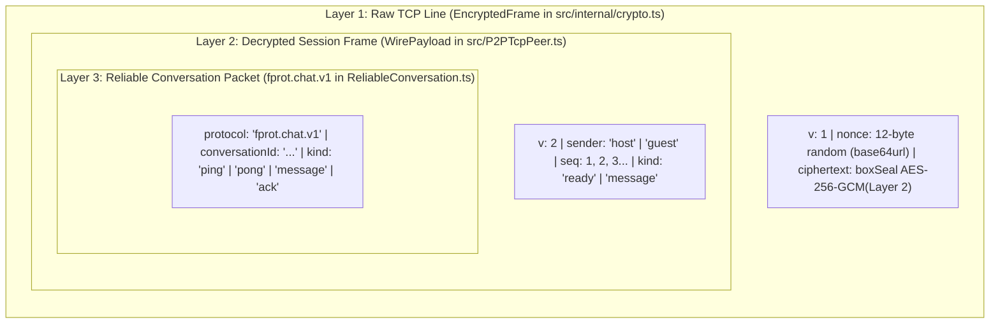

# Cryptography and Wire Protocol Reference

> **Documentation Navigation**
> - **[Part 1: Master Architecture & Overview (`HOW_IT_WORKS.md`)](./HOW_IT_WORKS.md)**
> - **[Part 2: Signaling Deep Dive (`SIGNALING_DEEP_DIVE.md`)](./SIGNALING_DEEP_DIVE.md)**
> - **[Part 3: Reliability, Storage & Resilience (`RELIABILITY_AND_RESILIENCE.md`)](./RELIABILITY_AND_RESILIENCE.md)**
> - **[Part 4: Cryptography & Wire Protocol Reference (`CRYPTOGRAPHY_AND_WIRE_PROTOCOL.md`)](./CRYPTOGRAPHY_AND_WIRE_PROTOCOL.md)** *(Current Page)*
> - **[Part 5: Custom Backend Integration (`CUSTOM_BACKEND_INTEGRATION.md`)](./CUSTOM_BACKEND_INTEGRATION.md)**

---

## 1. Cryptographic Primitives & Key Lifecycles

`fprot` implements all client-side cryptography and TCP sockets **natively inside `@harbouli/fprot`** with **zero third-party native crypto or TCP dependencies**:
- **iOS (`ios/FprotNative.swift`)**: Uses Apple **`CryptoKit`** (`Curve25519.Signing`, `Curve25519.KeyAgreement`, `AES.GCM`, `SHA256`, `SecRandomCopyBytes`) and POSIX BSD sockets (`Darwin.socket` + `DispatchSource`).
- **Android (`android/src/main/java/com/fprot/FprotCrypto.kt` & `FprotNativeModule.kt`)**: Uses RFC 8032 **Ed25519**, RFC 7748 **X25519**, Android JCA **`AES/GCM/NoPadding`**, **`SHA-256`**, **`SecureRandom`**, and `java.net.ServerSocket` / `Socket`.
- **Node.js / Jest (`src/internal/nativeCrypto.ts` & `server/signaling.mjs`)**: Uses Node.js native **`node:crypto`**, 100% bit-for-bit interoperable with iOS and Android.

All binary keys, nonces, signatures, and ciphertexts are encoded for JSON transport using **Base64URL without padding** (`toBase64Url` / `fromBase64Url`, RFC 4648 §5).

### 1.1 Complete Key Inventory

| Key Name | Algorithm / Curve | Raw Byte Length | Base64URL Length | Where Created | Where Stored & Lifetime |
| :--- | :--- | :---: | :---: | :--- | :--- |
| **Long-Term Identity Public Key** | Ed25519 (`signKeypair`) | `32 bytes` | `43 chars` | `loadOrCreateIdentity()` (`identity.ts`) | Persisted in Keychain/Keystore (`fprot.identity.v1`). Shared out-of-band with peers. |
| **Long-Term Identity Private Key** | Ed25519 (`signKeypair`) | `64 bytes` | `86 chars` | `loadOrCreateIdentity()` (`identity.ts`) | Persisted exclusively in Keychain/Keystore (`fprot.identity.v1`). Never leaves device. |
| **Ephemeral Session Public Key** | X25519 (`boxKeypair`) | `32 bytes` | `43 chars` | `createSessionKeys()` (`crypto.ts`) | RAM only. Created per `P2PTcpPeer` instance; exchanged over `p2p-tcp-control`. |
| **Ephemeral Session Private Key** | X25519 (`boxKeypair`) | `32 bytes` | `43 chars` | `createSessionKeys()` (`crypto.ts`) | RAM only. Zeroed via `privateKey.fill(0)` inside `P2PTcpPeer.dispose()`. |
| **Derived TCP Session Key** | `SHA-256("fprot.box.v1" \|\| ECDH \|\| sortedPubs)` | `32 bytes` | N/A | `deriveBoxSymmetricKey` / `deriveBoxKey` | Derived in native memory for `AES-256-GCM`; binds shared secret and both sorted public keys. |
| **Local Storage Secret Key** | AES-256-GCM (`secretboxKeygen`) | `32 bytes` | `43 chars` | `createEncryptedStorage()` (`identity.ts`) | Persisted in Keychain/Keystore (`fprot.storage-key.v1`). Encrypts local `MessageStore`. |
| **Conversation Store Hash Key** | SHA-256 (`sha256`) | `32 bytes` | `43 chars` | `conversationStorageKey()` (`identity.ts`) | Deterministic hash of `[conversationId, localKey, remoteKey]`. |

### 1.2 Forward Secrecy & Memory Zeroization

Because `ReliableConversation` uses long-term **Ed25519** keys *only* for signing transient connection setup signals, and `P2PTcpPeer` generates a fresh **X25519** Diffie-Hellman keypair in RAM for every single TCP connection attempt and zeroes the private key (`this.keys?.privateKey.fill(0)`) as soon as the TCP socket closes, **`fprot` achieves Perfect Forward Secrecy (PFS)**:
- Even if an attacker captures all encrypted TCP traffic on the local Wi-Fi network using **Wireshark** today and later steals the device's long-term Ed25519 private key from the Keychain, **the attacker cannot decrypt past TCP sessions** because the ephemeral X25519 private keys were never written to disk and were zeroed in memory upon session termination.

---

## 2. TCP Framing & `LineDecoder` Specification

TCP is a continuous byte stream (`SOCK_STREAM`) with no native concept of "message boundaries." A single `socket.write()` call may arrive at the receiver split across three `data` events, or four `socket.write()` calls may coalesce into a single `data` event (Nagle's algorithm / OS buffering, though `socket.setNoDelay(true)` is enabled by `P2PTcpPeer`).

### 2.1 Newline-Delimited JSON Framing (`\n`)

Every encrypted frame sent by `P2PTcpPeer.sendWire()` is serialized as compact JSON (containing no internal newline characters) followed by a single ASCII Line Feed (`\n`, `0x0A`):

```text
{"v":1,"nonce":"<16_chars_base64url>","ciphertext":"<base64url_aes256gcm_ciphertext_plus_16B_tag>"}\n
```

### 2.2 `LineDecoder` Buffer Protection (`src/internal/LineDecoder.ts`)

Incoming chunks from `socket.on('data')` are fed into `LineDecoder.push(chunk)`:
1. Appends `chunk` to an internal accumulator `this.buffer`.
2. Scans for `this.buffer.indexOf('\n')`.
3. **Pre-Split Overflow Guard**: If `newline > this.maxBytes`, or if no newline has been seen yet and `this.buffer.length > this.maxBytes` (default `1,048,576` bytes / 1 MB; minimum `32,768` bytes required by `ReliableConversation`), `LineDecoder` immediately throws `Error('Incoming TCP frame exceeds the configured size limit')`.
4. `P2PTcpPeer` catches this error and immediately calls `this.fail(error)`, destroying the TCP socket before memory can be exhausted by an attacker sending an infinite stream without `\n`.

---

## 3. Multi-Layer TCP Packet Encapsulation

Every application message or heartbeat travels through **three nested protocol schemas** over the TCP socket:



### Layer 1: `EncryptedFrame` (`src/internal/crypto.ts`)
```json
{
  "v": 1,
  "nonce": "k8P2mN9vR4xL1qW7",
  "ciphertext": "7mQ9xL2p...<AES_256_GCM_ciphertext_with_16_byte_GMAC_tag>"
}
```
- **Nonce**: 12 random bytes (`NONCE_BYTES = 12`) generated via OS CSPRNG (`SecRandomCopyBytes` on iOS, `SecureRandom` on Android) for *every single frame*.
- **Ciphertext**: Encrypted with `boxSeal(JSON.stringify(wirePayload), nonce, remoteX25519PublicKey, localX25519PrivateKey)` using **AES-256-GCM** with key `SHA-256("fprot.box.v1" || X25519(localPriv, remotePub) || min(pubA, pubB) || max(pubA, pubB))`. Includes a 16-byte (128-bit) authentication tag. Any bit-flip on the wire causes `boxOpen` to fail immediately.

### Layer 2: `WirePayload` (`src/P2PTcpPeer.ts`)
Once decrypted by `P2PTcpPeer.handleEncryptedLine()`, the plaintext JSON is validated against `WirePayload`:
```json
{
  "v": 2,
  "sender": "guest",
  "seq": 2,
  "kind": "message",
  "message": {
    "id": "xY9zA2bC5dE8fG1h",
    "sentAt": 1780000000123,
    "payload": {
      "protocol": "fprot.chat.v1",
      "conversationId": "main-chat-room",
      "kind": "message",
      "id": "mK8pQ1rS4tU7vW0x",
      "payload": "Hello over encrypted TCP!",
      "sentAt": 1780000000100
    }
  }
}
```
- **Strict Reflection & Sequence Verification (`P2PTcpPeer.ts` lines 491–498)**:
  - `payload.v === 2`
  - `payload.sender === (this.role === 'host' ? 'guest' : 'host')`: Prevents a reflection attack where an attacker captures an encrypted frame sent by the Host and reflects it back to the Host's own socket (checking `payload.sender` inside the authenticated ciphertext guarantees the frame was authored by the opposite role).
  - `payload.seq === this.rxSequence + 1`: Enforces a strict monotonically increasing 1-based sequence counter (`1, 2, 3, ...`). Dropping, duplicating, or reordering any TCP frame immediately fails the session with `Error('Rejected an invalid or replayed encrypted frame')`.
  - Sequence `1` (`payload.seq === 1`) MUST be `{ kind: 'ready' }` on both sides before any `{ kind: 'message' }` frame is permitted.

### Layer 3: `ReliableConversation` Packet (`fprot.chat.v1`)
Inside `payload.message.payload`, `ReliableConversation` places one of four packet shapes:

1. **Application Chat Message (`kind: "message"`)**:
   ```json
   {
     "protocol": "fprot.chat.v1",
     "conversationId": "main-chat-room",
     "kind": "message",
     "id": "mK8pQ1rS4tU7vW0x",
     "payload": { "text": "Meet at 5pm", "attachments": [] },
     "sentAt": 1780000000100
   }
   ```
2. **Delivery Acknowledgment (`kind: "ack"`)**:
   ```json
   {
     "protocol": "fprot.chat.v1",
     "conversationId": "main-chat-room",
     "kind": "ack",
     "id": "mK8pQ1rS4tU7vW0x"
   }
   ```
3. **Heartbeat Request (`kind: "ping"`)**:
   ```json
   {
     "protocol": "fprot.chat.v1",
     "conversationId": "main-chat-room",
     "kind": "ping"
   }
   ```
4. **Heartbeat Response (`kind: "pong"`)**:
   ```json
   {
     "protocol": "fprot.chat.v1",
     "conversationId": "main-chat-room",
     "kind": "pong"
   }
   ```

---

## 4. Comprehensive Threat Model & Defense Matrix

| Threat / Attack Vector | How `fprot` Mitigates It | Code Location |
| :--- | :--- | :--- |
| **Passive Wireshark Packet Sniffing** | Zero application data or metadata (`id`, `sentAt`, `seq`, `sender`, `kind`) appears in cleartext on the TCP wire. Every frame is sealed with `AES-256-GCM` under an ephemeral `X25519` key with a unique 12-byte random nonce. | `nativeCrypto.ts`, `P2PTcpPeer.ts`, `tcp.integration.test.ts:140-250` |
| **Compromised Signaling Server (MITM)** | All signaling envelopes are signed with Ed25519 (`fprot.signaling.v1:`) and verified against the pinned `remotePublicKey`. If the server alters the SDP or public key, signature verification fails. | `SignalProtocol.ts:34-40` |
| **Low-Order Curve25519 Point / Self-Key Attack** | Native KDF (`deriveBoxSymmetricKey` / `deriveBoxKey`) explicitly rejects remote public keys equal to `localPublicKey` and rejects any public key yielding an all-zero X25519 shared secret, and binds `min(pubA, pubB) \|\| max(pubA, pubB)` into SHA-256. | `FprotNative.swift:83-106`, `FprotCrypto.kt:154-171` |
| **Cross-Protocol Signature Replay** | Domain separation prefixes (`fprot.broker.v1:` vs `fprot.signaling.v1:` vs `fprot.identity.check`) ensure a signature created for one context is never valid in another. | `identity.ts:54`, `WebSocketSignaling.ts:64`, `SignalProtocol.ts:19` |
| **Stale / Replayed Signaling Offers** | Every handshake binds `offer` and `answer` to a fresh 16-char Guest `challenge` and 16-char Host `attempt`. Replayed signals are ignored. | `ReliableConversation.ts:258-280` |
| **Unauthorized TCP Port Scanning** | The Host's TCP server immediately destroys any incoming TCP socket if the WebRTC control handshake (`this.remotePublicKey`) has not completed or if one socket is already attached (`if (!this.remotePublicKey || this.socket) socket.destroy()`), and closes the listening port (`this.server.close()`) the instant `seq: 1` `ready` is verified. | `P2PTcpPeer.ts:366-369`, `523-526` |
| **TCP Ciphertext Reflection Attack** | Because ECDH produces a shared secret between Host and Guest, an attacker on the LAN could reflect a Host's frame back to the Host. `WirePayload` includes `"sender": "host" \| "guest"` inside the authenticated ciphertext and rejects self-originated frames. | `P2PTcpPeer.ts:491-497` |
| **TCP Frame Replay / Reordering / Drop** | Strict 1-indexed sequence numbers (`txSequence` and `rxSequence`) inside the authenticated ciphertext require `payload.seq === this.rxSequence + 1`. | `P2PTcpPeer.ts:494-498` |
| **Memory Exhaustion (Infinite Line DoS)** | `LineDecoder` enforces `maxFrameBytes` before and after scanning for `\n`. Broker and signaling decoders enforce `132 KB` / `128 KB` limits. | `LineDecoder.ts:11-23`, `SignalProtocol.ts:29` |
| **Local Storage Key-Swapping Attack** | `createEncryptedStorage` binds the storage record key `name` inside the `secretboxSeal` (`AES-256-GCM`) authenticated plaintext (`plain.name !== name`). | `identity.ts:115-126` |
| **Timing Attack on Broker Token** | `server/signaling.mjs` uses `crypto.timingSafeEqual` to compare the client's shared token against `FPROT_SIGNAL_TOKEN`. | `server/signaling.mjs:72-76` |
