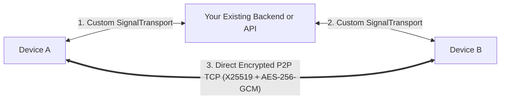
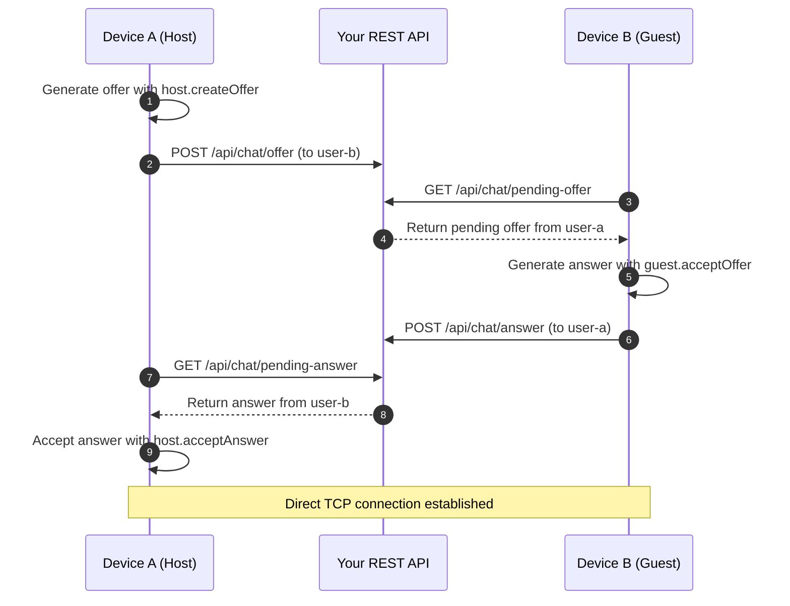

# Custom Backend Integration Guide for fprot

> **Documentation Navigation**
> - **[Part 1: Master Architecture & Overview (`HOW_IT_WORKS.md`)](./HOW_IT_WORKS.md)**
> - **[Part 2: Signaling Deep Dive (`SIGNALING_DEEP_DIVE.md`)](./SIGNALING_DEEP_DIVE.md)**
> - **[Part 3: Reliability, Storage & Resilience (`RELIABILITY_AND_RESILIENCE.md`)](./RELIABILITY_AND_RESILIENCE.md)**
> - **[Part 4: Cryptography & Wire Protocol Reference (`CRYPTOGRAPHY_AND_WIRE_PROTOCOL.md`)](./CRYPTOGRAPHY_AND_WIRE_PROTOCOL.md)**
> - **[Part 5: Custom Backend Integration (`CUSTOM_BACKEND_INTEGRATION.md`)](./CUSTOM_BACKEND_INTEGRATION.md)** *(Current Page)*

---

`fprot` is designed to be completely backend-agnostic. While it includes a turnkey WebSocket broker (`server/signaling.mjs`), you can easily integrate `fprot` into **your existing backend infrastructure**—including **Node.js/Express, Socket.io, NestJS, Go, Python/FastAPI, Supabase, Firebase, AWS API Gateway, or Redis Pub/Sub**.

This guide explains how `fprot` signaling works, what contract your backend must satisfy, and how to implement custom signaling transports.

---

## 1. How Signaling Works

Signaling only coordinates connection setup:
- It **never** sees or transmits chat messages.
- All chat messages travel exclusively across the direct peer-to-peer TCP socket.
- Your backend is only responsible for **forwarding signal envelopes** from Device A to Device B.
- Because all signal envelopes are cryptographically signed with the sender's Ed25519 identity key, **your backend cannot forge or tamper with connection offers even if it tried**.



---

## 2. The `SignalTransport` Interface

To connect `ReliableConversation` to your backend, you implement the `SignalTransport` interface:

```ts
export interface SignalTransport {
  /**
   * Called when ReliableConversation starts.
   * Provide callback handlers for incoming signals and network status.
   */
  start(handlers: {
    onMessage: (message: string) => void;
    onOnline: (online: boolean) => void;
  }): void;

  /**
   * Called when ReliableConversation wants to send a signal to the remote peer.
   * Returns true if queued/sent successfully, false if transport is offline.
   */
  send(message: string): boolean;

  /**
   * Called when the conversation is stopped or unmounted.
   * Clean up open sockets, timers, and subscriptions here.
   */
  stop(): void;
}
```

---

## 3. Signal Envelope Wire Format

When `send(message)` is called by `ReliableConversation`, the `message` string is a serialized JSON envelope produced by `encodeSignal()` (`src/reliable/SignalProtocol.ts`) containing two fields (`body` and `signature`):

```json
{
  "body": "{\"v\":1,\"from\":\"Ed25519_PUBLIC_KEY_SENDER\",\"to\":\"Ed25519_PUBLIC_KEY_RECIPIENT\",\"conversationId\":\"my-chat-room-42\",\"type\":\"offer\",\"challenge\":\"e82d1c3a9b4f1e2d\",\"attempt\":\"4fa8120b7c6d5e3f\",\"sdp\":\"...\"}",
  "signature": "BASE64URL_ED25519_SIGNATURE_OVER_fprot.signaling.v1:body"
}
```

When you parse `JSON.parse(envelope.body)`, the inner `Signal` object has this structure:

```json
{
  "v": 1,
  "from": "Ed25519_PUBLIC_KEY_SENDER",
  "to": "Ed25519_PUBLIC_KEY_RECIPIENT",
  "conversationId": "my-chat-room-42",
  "type": "wake | request | offer | answer",
  "challenge": "e82d1c3a9b4f1e2d",
  "attempt": "4fa8120b7c6d5e3f",
  "sdp": "{\"v\":1,\"type\":\"offer\",\"sdp\":\"v=0\\r\\no=- ...\"}"
}
```

### What your backend needs to do:
1. Parse the outer `envelope = JSON.parse(rawMessage)` and inner `body = JSON.parse(envelope.body)` to inspect `body.from` and `body.to`.
2. Verify that `body.from` matches the authenticated sender's public key, and forward the **exact unmodified `rawMessage` string** to the connected client matching `body.to`.
3. That's it! The recipient's client calls `handlers.onMessage(rawMessage)` and `decodeSignal()` verifies the Ed25519 signature over `fprot.signaling.v1:${envelope.body}`.

---

## 4. Implementation Example 1: Socket.io / Node.js Backend

### Client: Custom `SignalTransport` (`SocketIOSignaling.ts`)

```ts
import { io, Socket } from 'socket.io-client';
import type { SignalTransport } from 'fprot';

export interface SocketIOSignalingOptions {
  serverUrl: string;
  authToken: string;
  myPublicKey: string;
}

export class SocketIOSignaling implements SignalTransport {
  private socket?: Socket;
  private handlers?: {
    onMessage: (message: string) => void;
    onOnline: (online: boolean) => void;
  };

  constructor(private options: SocketIOSignalingOptions) {}

  start(handlers: {
    onMessage: (message: string) => void;
    onOnline: (online: boolean) => void;
  }): void {
    this.handlers = handlers;

    this.socket = io(this.options.serverUrl, {
      auth: {
        token: this.options.authToken,
        publicKey: this.options.myPublicKey,
      },
      transports: ['websocket'],
    });

    this.socket.on('connect', () => {
      this.handlers?.onOnline(true);
    });

    this.socket.on('disconnect', () => {
      this.handlers?.onOnline(false);
    });

    // Listen for incoming signals routed by your backend
    this.socket.on('fprot:signal', (rawSignal: string) => {
      this.handlers?.onMessage(rawSignal);
    });
  }

  send(message: string): boolean {
    if (!this.socket?.connected) return false;

    // Send the signal envelope to your backend
    this.socket.emit('fprot:signal', message);
    return true;
  }

  stop(): void {
    this.socket?.disconnect();
    this.socket = undefined;
    this.handlers = undefined;
  }
}
```

### Server: Node.js / Express + Socket.io Handler

```js
import { Server } from 'socket.io';

const io = new Server(server, { cors: { origin: '*' } });

// Map: publicKey -> socket.id
const activeUsers = new Map();

io.use((socket, next) => {
  const { token, publicKey } = socket.handshake.auth;
  // 1. Verify your user's auth token (JWT, session, etc.)
  if (!isValidUserToken(token)) {
    return next(new Error('Unauthorized'));
  }
  socket.publicKey = publicKey;
  next();
});

io.on('connection', (socket) => {
  activeUsers.set(socket.publicKey, socket.id);

  socket.on('fprot:signal', (rawSignal) => {
    try {
      // 2. Parse envelope to find the destination
      const envelope = JSON.parse(rawSignal);
      
      // Enforce sender integrity
      if (envelope.from !== socket.publicKey) {
        return; // Prevent spoofing 'from'
      }

      const recipientSocketId = activeUsers.get(envelope.to);
      if (recipientSocketId) {
        // 3. Deliver signal directly to recipient
        io.to(recipientSocketId).emit('fprot:signal', rawSignal);
      } else {
        // Optional: Trigger an APNs/FCM push notification to wake recipient's phone!
        sendPushNotification(envelope.to, {
          title: 'Incoming chat request',
          body: 'Open app to connect',
        });
      }
    } catch (err) {
      console.error('Malformed signal:', err);
    }
  });

  socket.on('disconnect', () => {
    activeUsers.delete(socket.publicKey);
  });
});
```

---

## 5. Implementation Example 2: Supabase Realtime (Serverless)

With Supabase, you can implement signaling with **zero backend server code** using Supabase Realtime Broadcast channels:

```ts
import { createClient, RealtimeChannel } from '@supabase/supabase-js';
import type { SignalTransport } from 'fprot';

export class SupabaseSignaling implements SignalTransport {
  private channel?: RealtimeChannel;
  private handlers?: {
    onMessage: (message: string) => void;
    onOnline: (online: boolean) => void;
  };

  constructor(
    private supabase: ReturnType<typeof createClient>,
    private conversationId: string,
    private myPublicKey: string
  ) {}

  start(handlers: {
    onMessage: (message: string) => void;
    onOnline: (online: boolean) => void;
  }): void {
    this.handlers = handlers;

    // Join a broadcast channel scoped to this conversation
    this.channel = this.supabase.channel(`fprot:${this.conversationId}`, {
      config: { broadcast: { self: false } },
    });

    this.channel
      .on('broadcast', { event: 'signal' }, (payload) => {
        const raw = payload.payload?.data;
        if (typeof raw === 'string') {
          try {
            const envelope = JSON.parse(raw);
            // Only handle signals meant for me
            if (envelope.to === this.myPublicKey) {
              this.handlers?.onMessage(raw);
            }
          } catch {}
        }
      })
      .subscribe((status) => {
        this.handlers?.onOnline(status === 'SUBSCRIBED');
      });
  }

  send(message: string): boolean {
    if (!this.channel) return false;

    void this.channel.send({
      type: 'broadcast',
      event: 'signal',
      payload: { data: message },
    });
    return true;
  }

  stop(): void {
    if (this.channel) {
      void this.supabase.removeChannel(this.channel);
      this.channel = undefined;
    }
    this.handlers = undefined;
  }
}
```

---

## 6. Implementation Example 3: Low-Level `P2PTcpPeer` with REST API

If you prefer using `P2PTcpPeer` directly without long-lived WebSockets, you can exchange the offer and answer via simple HTTP REST endpoints:



---

## 7. Backend Security Best Practices

When building your backend signaling service:

1. **Authenticate Every Connection**:
   Always require a user session token (JWT, cookie, or API key). Never allow anonymous clients to send signals to arbitrary public keys without authentication.
2. **Prevent Sender Spoofing**:
   Verify that `envelope.from` matches the authenticated user's registered public key. This prevents malicious users from impersonating other peers during signaling.
3. **Limit Payload Sizes**:
   WebRTC SDP strings and ICE candidate envelopes are typically between 1 KB and 64 KB. Set a strict payload limit (e.g. `132 KB`) on your signaling endpoints.
4. **Discard Stale Signals**:
   SDP offers expire quickly (WebRTC ICE candidates usually become stale after 30–60 seconds). Do not store signals in long-term databases. If a recipient is offline, trigger a push notification rather than buffering hours of obsolete SDP strings.
5. **No Decryption Required**:
   Your backend never needs any cryptographic keys. Do not attempt to inspect or modify the `sdp` or `signature` fields.
