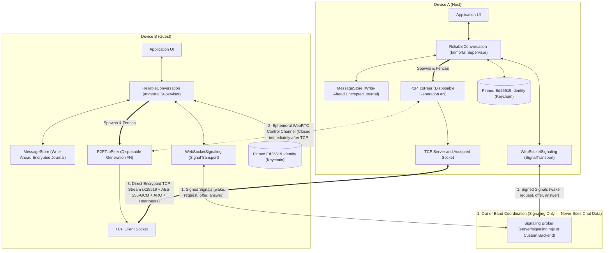
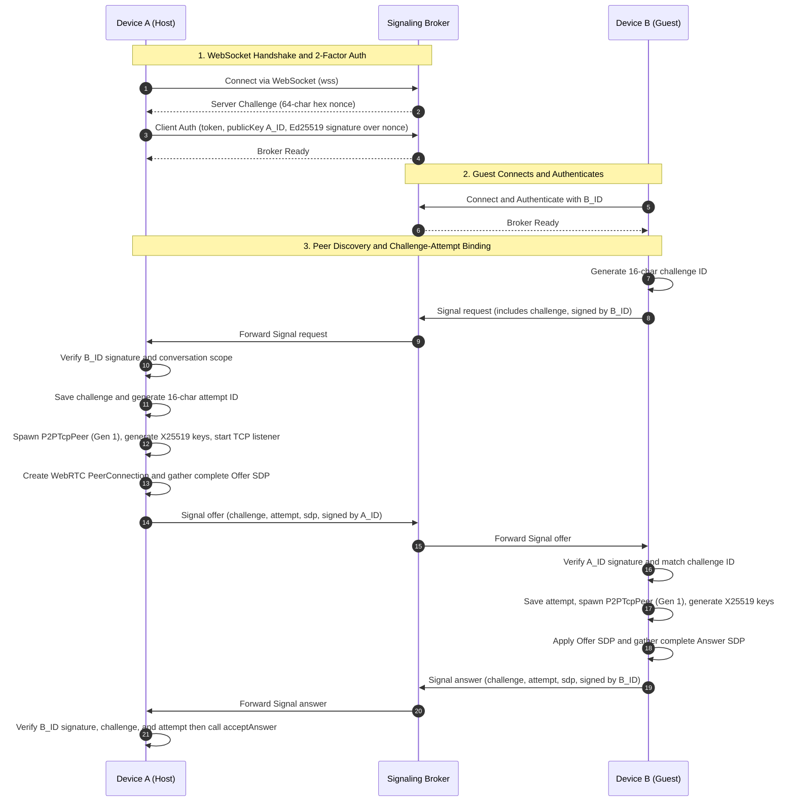
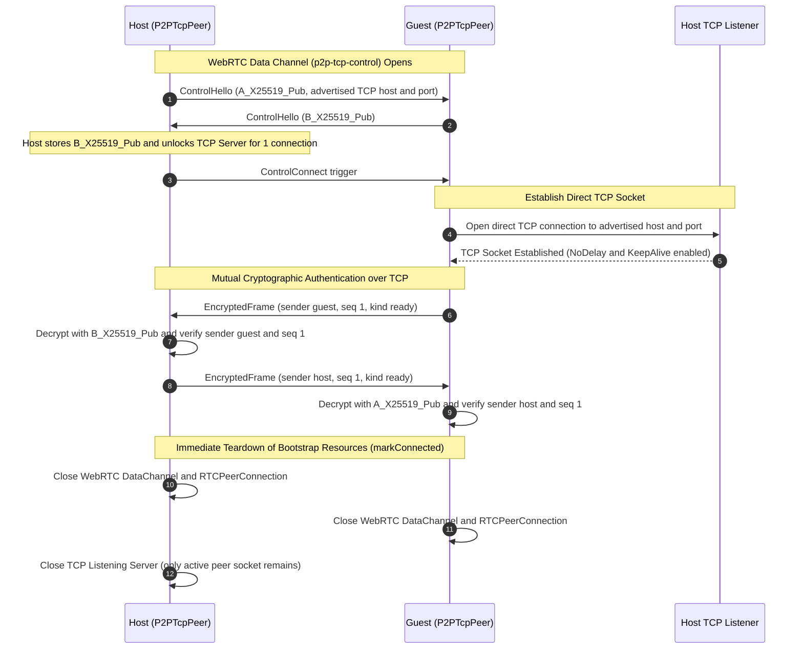
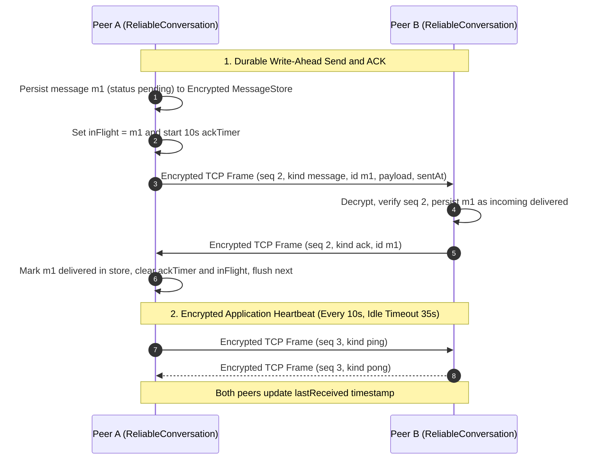
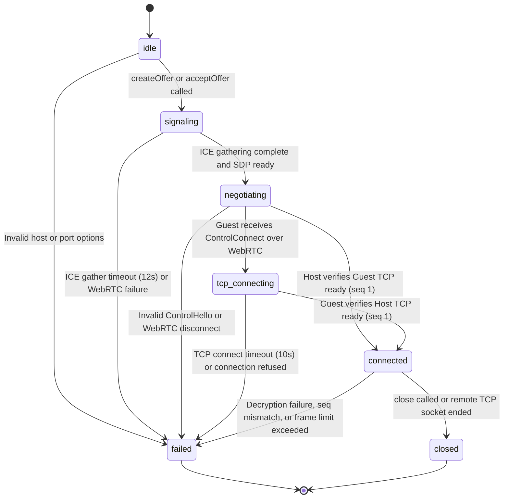
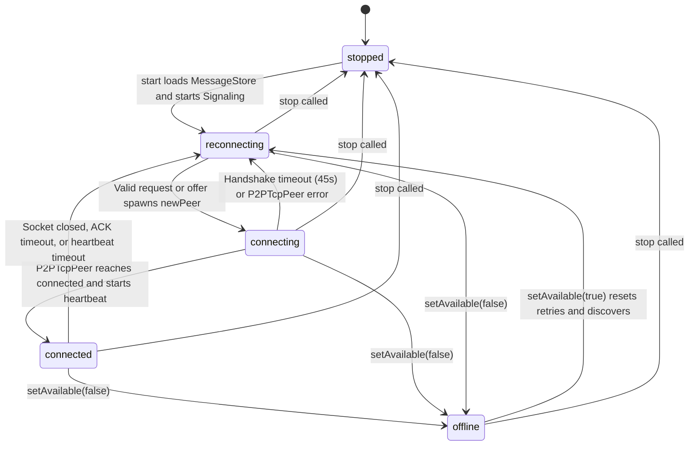

# Architecture and Protocol Specification: How fprot Works

> **Multi-Page Documentation Suite**
> - **[Part 1: Master Architecture & Overview (`HOW_IT_WORKS.md`)](./HOW_IT_WORKS.md)** *(Current Page)*
> - **[Part 2: Signaling Deep Dive (`SIGNALING_DEEP_DIVE.md`)](./SIGNALING_DEEP_DIVE.md)** — What Signaling is, the Bootstrap Paradox, `wake`/`request`/`offer`/`answer` state machine, `challenge` & `attempt` nonces, `server/signaling.mjs` internals, and WebRTC control channel teardown.
> - **[Part 3: Reliability, Storage & Resilience (`RELIABILITY_AND_RESILIENCE.md`)](./RELIABILITY_AND_RESILIENCE.md)** — Immortal `ReliableConversation` vs. disposable `P2PTcpPeer`, generation fencing, `MessageStore` write-ahead journal, Stop-and-Wait ARQ (`inFlight`), idempotent deduplication, encrypted heartbeats, and exponential backoff with jitter.
> - **[Part 4: Cryptography & Wire Protocol Reference (`CRYPTOGRAPHY_AND_WIRE_PROTOCOL.md`)](./CRYPTOGRAPHY_AND_WIRE_PROTOCOL.md)** — Complete key inventory, Perfect Forward Secrecy, `LineDecoder` framing, 3-layer TCP packet schemas, and Threat Defense Matrix.
> - **[Part 5: Custom Backend Integration (`CUSTOM_BACKEND_INTEGRATION.md`)](./CUSTOM_BACKEND_INTEGRATION.md)** — Implementing `SignalTransport` over Socket.io, Express, Supabase Realtime, or REST APIs.

---

`fprot` provides authenticated, end-to-end encrypted peer-to-peer TCP messaging for React Native applications. WebRTC is used **exclusively during connection setup** to discover reachable endpoints and exchange ephemeral session public keys. The instant both peers mutually authenticate each other over a raw TCP socket (`seq: 1`, `kind: "ready"`), the WebRTC session (`RTCPeerConnection` and `RTCDataChannel`) and the TCP listening server are permanently closed, and all application traffic flows directly across the encrypted TCP stream.

This master specification describes the system architecture, what signaling is and how it works, how reliability and offline persistence are guaranteed, cryptographic specifications, protocol sequence flows, wire frame formats, state machines, and production integration patterns.

---

## 1. System Architecture Overview

`fprot` is structured into two distinct architectural tiers:

1. **Low-Level Ephemeral Session Transport (`P2PTcpPeer` in [`src/P2PTcpPeer.ts`](../src/P2PTcpPeer.ts))**:
   - Manages **one single-use peer-to-peer session** (`idle` $\rightarrow$ `signaling` $\rightarrow$ `negotiating` $\rightarrow$ `tcp-connecting` $\rightarrow$ `connected` $\rightarrow$ `closed` / `failed`).
   - Starts a local native TCP server (`Host`) or native TCP client (`Guest`), gathers non-trickle WebRTC ICE candidates, exchanges ephemeral X25519 public keys and the TCP endpoint over an ordered WebRTC data channel (`p2p-tcp-control`), performs a mutually authenticated handshake over TCP, closes WebRTC, and encrypts every newline-delimited TCP frame using native X25519 + SHA-256 + `AES-256-GCM` (`boxSeal`) with strict monotonic sequence numbers (`txSequence` / `rxSequence`).
2. **Resilient Application & Reliability Layer (`ReliableConversation` in [`src/reliable/ReliableConversation.ts`](../src/reliable/ReliableConversation.ts))**:
   - Sits on top of `P2PTcpPeer` as an **immortal supervisor** that survives Wi-Fi/Cellular switches, IP address changes, OS backgrounding, half-open socket drops, and app restarts.
   - Manages pinned long-term Ed25519 identity keys (`loadOrCreateIdentity`), encrypted local write-ahead journaling (`MessageStore` + `createEncryptedStorage`), Stop-and-Wait ARQ delivery acknowledgments (`inFlight` + `ackTimer`), application-layer encrypted heartbeats (`ping`/`pong`), generation fencing (`this.generation`), and automated peer discovery over an authenticated signaling transport (`WebSocketSignaling`).



---

## 2. What is Signaling & How Connection Setup Works

> 📖 *For the exhaustive line-by-line guide to signaling, see **[Part 2: Signaling Deep Dive (`SIGNALING_DEEP_DIVE.md`)](./SIGNALING_DEEP_DIVE.md)**.*

### 2.1 Why Signaling is Needed (The Bootstrap Paradox)
Two mobile devices cannot simply open a raw TCP socket to each other out of thin air because:
1. **Dynamic IP Addresses & Ephemeral Ports**: A device's local IP (`192.168.1.x` or VPN IP) changes whenever networks switch, and the Host binds a random free OS port (`port: 0`) for each session.
2. **Asynchronous Wake States**: Device A and Device B may open the app at different times; they need a rendezvous mechanism to learn *when* the partner is online.
3. **Pre-TCP Key Exchange**: To ensure the very first frame transmitted over TCP is already encrypted and authenticated, peers must exchange ephemeral X25519 public keys *before* the Guest connects to the Host's TCP socket.

**Signaling** is the out-of-band coordination layer that exchanges small, Ed25519-signed control envelopes (`wake`, `request`, `offer`, `answer`) to bootstrap a direct connection.
- **Signaling never carries chat messages.**
- **The signaling server is completely untrusted.** Because every signal is signed by the sender's pinned Ed25519 private key (`fprot.signaling.v1:<body_json>`), a compromised signaling server cannot forge an offer, substitute a public key, or read any conversation message.

### 2.2 The Four Signal Types (`SignalProtocol.ts`)

| Type | Direction | Fields Used | Exact Role in the Handshake |
| :--- | :---: | :--- | :--- |
| **`wake`** | `Host -> Guest` | `from`, `to`, `conversationId` | Announces that the Host is online and ready to generate an offer. If the Guest is listening and has no active peer, it replies with a `request`. |
| **`request`** | `Guest -> Host` | `+ challenge` (16 chars) | Initiates a handshake attempt. The Guest generates a random 96-bit base64url `challenge` (`randomId()`). Repeated `wake` signals reuse the same `challenge` so an in-flight offer is never invalidated. |
| **`offer`** | `Host -> Guest` | `+ challenge`, `attempt`, `sdp` | Upon receiving `request`, the Host spawns a new `P2PTcpPeer`, opens a TCP server port, gathers WebRTC ICE candidates into a self-contained SDP offer, generates a 16-char `attempt` ID, and sends `(challenge, attempt, sdp)`. |
| **`answer`** | `Guest -> Host` | `+ challenge`, `attempt`, `sdp` | The Guest verifies `signal.challenge === this.challenge`, spawns a new `P2PTcpPeer`, applies the remote SDP offer, gathers its own ICE candidates into an SDP answer, and echoes `(challenge, attempt, sdp)`. |

### 2.3 Two-Stage Handshake: Broker $\rightarrow$ WebRTC Control Channel $\rightarrow$ Raw TCP

1. **Broker Authentication (`WebSocketSignaling.ts` $\leftrightarrow$ `server/signaling.mjs`)**:
   - When a client connects to `server/signaling.mjs`, the server issues a 32-byte hex `challenge` nonce (`{ "type": "challenge", "nonce": "..." }`) with a 10-second deadline.
   - The client proves possession of both the deployment shared token (`FPROT_SIGNAL_TOKEN`, verified via `timingSafeEqual`) and its Ed25519 private key by signing `fprot.broker.v1:${nonce}`.
   - The server verifies the Ed25519 signature using Node's native `crypto.verify` (constructing the ASN.1 DER SPKI key with prefix `302a300506032b6570032100`), registers `peers.set(publicKey, socket)`, and replies `{ "type": "ready" }`.
2. **WebRTC Control Channel (`p2p-tcp-control` in `P2PTcpPeer.ts`)**:
   - Once `offer` and `answer` SDP strings are exchanged, WebRTC opens an ordered data channel `p2p-tcp-control`.
   - The **Host** sends `ControlHello`: `{ "type": "hello", "v": 1, "publicKey": "<Host_X25519_Pub>", "endpoint": { "host": "192.128.0.0", "port": 54321 } }`.
   - The **Guest** sends `ControlHello`: `{ "type": "hello", "v": 1, "publicKey": "<Guest_X25519_Pub>" }`.
   - Once the Host receives the Guest's `publicKey` (which unlocks the Host's TCP listener to accept 1 socket), the Host sends `{ "type": "connect" }`.
3. **Direct TCP Connection & WebRTC Teardown (`markConnected()`)**:
   - The Guest opens a raw TCP socket (`TcpSocket.createConnection`) to `endpoint.host:endpoint.port` and sends an encrypted TCP frame with `seq: 1, kind: "ready"`.
   - The Host decrypts and verifies `seq: 1`, replies with its own encrypted TCP frame `seq: 1, kind: "ready"`, and both sides call `markConnected()`, which **immediately closes the WebRTC `RTCDataChannel`, closes the `RTCPeerConnection`, and closes the Host's listening TCP server**.

---

## 3. How Reliability Works in `fprot`

> 📖 *For the complete deep dive into reliability mechanisms, failure recovery, and storage internals, see **[Part 3: Reliability, Storage & Resilience (`RELIABILITY_AND_RESILIENCE.md`)](./RELIABILITY_AND_RESILIENCE.md)**.*

Raw TCP sockets only guarantee ordered delivery while a single socket remains open. Whenever a mobile user switches from Wi-Fi to Cellular, walks out of range, or backgrounds the app, the underlying OS TCP socket dies. `ReliableConversation` provides **seven overlapping reliability guarantees** on top of `P2PTcpPeer`:

### 3.1 Ephemeral Peers & Generation Fencing (`this.generation`)
- Every time a connection attempt starts (`newPeer()`) or drops (`dropPeer()`), `ReliableConversation` increments `++this.generation` and creates a brand-new disposable `P2PTcpPeer`.
- Every asynchronous callback, promise continuation (`getHostOptions`, `createOffer`, `acceptOffer`, `acceptAnswer`), event listener (`state`, `error`, `close`, `message`), and timeout (`deadline`, `ackTimer`) checks `this.current(peer, generation)`.
- Stale events from a previous generation are strictly fenced and ignored, eliminating race conditions during rapid network switches.

### 3.2 Durable Single-Writer Journal (`MessageStore.ts`)
- Before `sendMessage(payload)` even attempts to write to the TCP socket or update the UI, it commits the message with `status: 'pending'` to `MessageStore`.
- `MessageStore` uses a serialized transaction queue (`this.queue`) that writes the entire conversation snapshot to persistent storage (`await this.storage.setItem(...)`) **before** updating the in-memory array (`this.rows`) or emitting to React state.
- **Strict Payload Validation (`validatePayload`)**: Rejects serialized payloads over `2,730` characters (`MAX_MESSAGE_BYTES / 6`) and recursively inspects values to reject `undefined`, `NaN`, `Infinity`, `function`, and `symbol` (which standard `JSON.stringify` would silently corrupt into `null` or omit).

### 3.3 Encrypted At-Rest Storage with Record Binding (`createEncryptedStorage`)
- Local message history is encrypted with native `AES-256-GCM` (`secretboxSeal`) using a 256-bit key stored in the OS Keychain/Keystore (`fprot.storage-key.v1`).
- Conversation keys in `AsyncStorage` are anonymized using 32-byte `SHA-256` (`sha256(JSON.stringify([conversationId, localPublicKey, remotePublicKey]))`).
- **Record Binding**: Each ciphertext encrypts `{ name, value }` and verifies `plain.name === name` upon decryption so an attacker cannot swap encrypted records between different storage keys.

### 3.4 Stop-and-Wait ARQ & Idempotent Deduplication (`inFlight` & `ack`)
- `flush()` keeps **at most one unacknowledged outgoing message in flight at a time** (`this.inFlight = message.id`), guarded by a 10-second timer (`ackTimeoutMs`).
- This bounds memory buffering and guarantees **strict FIFO message ordering** across reconnections.
- When the recipient receives `{ kind: "message", id, payload, sentAt }`, it persists the message to `MessageStore` (`direction: "incoming"`, `status: "delivered"`) *before* sending back `{ kind: "ack", id }`.
- **What if the `ack` packet is lost during a network drop?**
  - Upon reconnecting, the sender re-transmits the same message with the original `id`, `sentAt`, and `payload`.
  - The recipient's `MessageStore.add()` detects that `incoming:${id}` already exists with identical `sentAt` and `payload`, returns `false` (preventing duplicate UI messages), and **re-transmits the `{ kind: "ack", id }`**, allowing the sender to mark the message `'delivered'` and advance its queue!

### 3.5 Serialized Inbound Queue (`this.inbound`)
- Incoming decrypted TCP packets are chained onto `this.inbound = this.inbound.then(...)` so disk writes (`store.add`, `store.acknowledge`) and `inFlight` state transitions execute strictly one at a time in arrival order.

### 3.6 Encrypted Application Heartbeats & Glare Immunity (`heartbeatMs` vs `idleTimeoutMs`)
- Every `heartbeatMs` (`10,000 ms`), a `connected` peer checks if `Date.now() - this.lastReceived > this.timing.idle` (`35,000 ms`). If so, it declares a half-open socket timeout (`Peer heartbeat timed out`) and triggers reconnection; otherwise it sends an encrypted `{ kind: "ping" }`, eliciting an encrypted `{ kind: "pong" }`.
- **Glare & DoS Immunity**: While `this.state === 'connected'`, `ReliableConversation` **ignores all incoming signaling packets** (`if (this.state === 'connected') return;`). A restarted partner or a replayed signaling packet cannot tear down a live session; the peer relies solely on its encrypted TCP heartbeat to detect if the partner truly disconnected.

### 3.7 Exponential Backoff with Multiplicative Jitter (`scheduleRetry`)
- When disconnected, discovery signals (`wake` / `request`) are retried using:
  $$\text{delay} = \min(\text{retryMaxMs}, \text{retryMinMs} \times 2^{\min(\text{retries}, 10)}) \times (0.75 + 0.5 \times \text{random}())$$
- Calling `setAvailable(true)` (e.g., when the app comes to the foreground) or `reconnect()` (when `NetInfo` detects a Wi-Fi IP change) immediately resets `retries = 0` and triggers discovery with zero delay.

---

## 4. Cryptographic Security Model

> 📖 *For full byte-level schemas and the security threat matrix, see **[Part 4: Cryptography & Wire Protocol Reference (`CRYPTOGRAPHY_AND_WIRE_PROTOCOL.md`)](./CRYPTOGRAPHY_AND_WIRE_PROTOCOL.md)**.*

Every session uses multi-layered cryptography ensuring end-to-end privacy, **Perfect Forward Secrecy (PFS)**, and identity authenticity.

| Layer | Algorithm / Primitive | Purpose | Lifetime |
| :--- | :--- | :--- | :--- |
| **Long-Term Identity** | Ed25519 (`signDetached`) | Authenticates broker login (`fprot.broker.v1:`) and signs signaling envelopes (`fprot.signaling.v1:`). | Long-term (stored in Keychain / Keystore). |
| **Broker Authentication** | Ed25519 Signature + Shared Token | Proves possession of public key against a 32-byte server challenge nonce + `timingSafeEqual` token check. | Per WebSocket connection. |
| **Ephemeral Session Keys** | X25519 (`boxKeypair`) | Ephemeral Diffie-Hellman keypair generated in RAM per connection attempt and exchanged over WebRTC. | Ephemeral (`privateKey.fill(0)` on close). |
| **TCP Frame Encryption** | `boxSeal` (X25519 + SHA-256 + AES-256-GCM) | Encrypts and authenticates every TCP frame payload with a fresh random 12-byte nonce and strict `seq` counter. | Per TCP frame. |
| **Local Store Encryption** | `secretboxSeal` (AES-256-GCM) | Encrypts queued and historical messages in `AsyncStorage` / SQLite with record-name binding. | Device-local (`fprot.storage-key.v1`). |

---

## 5. Protocol Sequence Flows

### Flow A: Signaling Broker Auth & Challenge-Attempt Handshake



---

### Flow B: Ephemeral WebRTC Control Channel & Direct TCP Cutover



---

### Flow C: Stop-and-Wait ARQ Messaging, Deduplication & Heartbeats



---

## 6. Wire Protocol and Frame Formats

### 1. Signed Signaling Envelope (`SignalProtocol.ts`)
Passed to `SignalTransport.send(rawString)`:
```json
{
  "body": "{\"v\":1,\"conversationId\":\"chat1\",\"from\":\"<Ed25519_Pub_Sender>\",\"to\":\"<Ed25519_Pub_Recipient>\",\"type\":\"offer\",\"challenge\":\"aB3dE6fG9hJ2kL5m\",\"attempt\":\"pQ8rS1tU4vW7xY0z\",\"sdp\":\"{\\\"v\\\":1,\\\"type\\\":\\\"offer\\\",\\\"sdp\\\":\\\"v=0...\\\"}\"}",
  "signature": "<Base64URL_Ed25519_Signature_over_fprot.signaling.v1:body>"
}
```

### 2. WebRTC Control Channel Frames (`p2p-tcp-control`)
Plaintext UTF-8 JSON sent over the temporary ordered WebRTC data channel:
- **Host `ControlHello`**:
  ```json
  {
    "type": "hello",
    "v": 1,
    "publicKey": "<Base64URL_32B_X25519_Public_Key>",
    "endpoint": { "host": "192.128.0.0", "port": 54321 }
  }
  ```
- **Guest `ControlHello`**:
  ```json
  {
    "type": "hello",
    "v": 1,
    "publicKey": "<Base64URL_32B_X25519_Public_Key>"
  }
  ```
- **Host `ControlConnect` Trigger**:
  ```json
  { "type": "connect" }
  ```

### 3. Raw TCP Wire Frame (`EncryptedFrame` + `\n`)
Every packet on the TCP stream is a single line of JSON terminated by `\n` (`LineDecoder` enforces `maxFrameBytes`):
```text
{"v":1,"nonce":"<Base64URL_12_Bytes>","ciphertext":"<Base64URL_AES_256_GCM_Ciphertext>"}\n
```

### 4. Decrypted TCP Session Payload (`WirePayload` + `fprot.chat.v1`)
Decrypting `ciphertext` with `boxOpen` yields `WirePayload` (`v: 2`), whose `message.payload` carries the `fprot.chat.v1` packet:
```json
{
  "v": 2,
  "sender": "host",
  "seq": 2,
  "kind": "message",
  "message": {
    "id": "xY9zA2bC5dE8fG1h",
    "sentAt": 1780000000000,
    "payload": {
      "protocol": "fprot.chat.v1",
      "conversationId": "chat1",
      "kind": "message",
      "id": "18c21a4f9b0d2e3c",
      "payload": "Hello, world!",
      "sentAt": 1780000000000
    }
  }
}
```

---

## 7. State Machine Specifications

### `P2PTcpPeer` State Transitions (Single-Use Disposable Session)



### `ReliableConversation` State Transitions (Persistent Supervisor)



---

## 8. Integration Guide for Host Applications

### Installation

```sh
npm install @harbouli/fprot react-native-webrtc @react-native-async-storage/async-storage react-native-keychain @react-native-community/netinfo
```

### iOS Configuration
In `ios/Podfile`:
```ruby
ENV['RCT_NEW_ARCH_ENABLED'] = '1'

post_install do |installer|
  installer.pods_project.targets.each do |target|
    target.build_configurations.each do |config|
      if config.build_settings['IPHONEOS_DEPLOYMENT_TARGET'].to_f < 15.1
        config.build_settings['IPHONEOS_DEPLOYMENT_TARGET'] = '15.1'
      end
    end
  end
end
```

In `ios/<YourApp>/Info.plist`:
```xml
<key>NSLocalNetworkUsageDescription</key>
<string>Connect directly to paired devices and the local signaling server.</string>
```

Run:
```sh
cd ios && pod install
```

### Android Configuration
In `android/app/src/main/AndroidManifest.xml`:
```xml
<uses-permission android:name="android.permission.INTERNET" />
<uses-permission android:name="android.permission.ACCESS_NETWORK_STATE" />
<uses-permission android:name="android.permission.ACCESS_WIFI_STATE" />
```

---

## 9. Complete Production Integration Example (With AppState & NetInfo Resilience)

```tsx
import React, { useEffect, useState } from 'react';
import { AppState, View, Text, Button, TextInput, FlatList } from 'react-native';
import AsyncStorage from '@react-native-async-storage/async-storage';
import * as Keychain from 'react-native-keychain';
import NetInfo from '@react-native-community/netinfo';
import {
  ReliableConversation,
  WebSocketSignaling,
  loadOrCreateIdentity,
  createEncryptedStorage,
  type ChatMessage,
  type ConversationState,
} from 'fprot';

// 1. Keychain-backed secure storage for Ed25519 private key & secretbox storage key
const secureStorage = {
  async getItem(key: string) {
    const creds = await Keychain.getGenericPassword({ service: key });
    return creds ? creds.password : null;
  },
  async setItem(key: string, value: string) {
    await Keychain.setGenericPassword('fprot', value, { service: key });
  },
};

export function ChatScreen({ friendPublicKey, isHost }: { friendPublicKey: string; isHost: boolean }) {
  const [chat, setChat] = useState<ReliableConversation | null>(null);
  const [messages, setMessages] = useState<ChatMessage[]>([]);
  const [state, setState] = useState<ConversationState>('stopped');
  const [input, setInput] = useState('');

  useEffect(() => {
    let conversation: ReliableConversation | undefined;
    let lastIpAddress: string | undefined;

    async function init() {
      // 2. Load or generate long-term Ed25519 identity keypair
      const identity = await loadOrCreateIdentity(secureStorage);
      // 3. Setup AES-256-GCM encrypted storage for durable message queues
      const storage = await createEncryptedStorage(AsyncStorage, secureStorage);

      conversation = new ReliableConversation({
        identity,
        remotePublicKey: friendPublicKey,
        conversationId: 'main-chat-room',
        role: isHost ? 'host' : 'guest',
        storage,
        signaling: new WebSocketSignaling({
          url: 'wss://signal.yourdomain.com:8787',
          token: 'your-secure-shared-signaling-token-32-chars-min',
          identity,
        }),
        getHostOptions: async () => {
          const network = await NetInfo.fetch();
          const ip = (network.details as { ipAddress?: string } | null)?.ipAddress;
          if (!ip) throw new Error('No local IP address available');
          return { advertiseHost: ip };
        },
      });

      conversation.on('state', setState);
      conversation.on('messages', setMessages);
      await conversation.start();
      setChat(conversation);
    }

    init();

    // 4. Feed OS Foreground/Background transitions into setAvailable()
    const appStateSub = AppState.addEventListener('change', (nextState) => {
      conversation?.setAvailable(nextState === 'active');
    });

    // 5. Feed network availability and IP handovers into setAvailable() / reconnect()
    const netInfoSub = NetInfo.addEventListener((netState) => {
      if (!conversation) return;
      const connected = Boolean(netState.isConnected);
      conversation.setAvailable(connected);
      const currentIp = (netState.details as { ipAddress?: string } | null)?.ipAddress;
      if (connected && currentIp && lastIpAddress && currentIp !== lastIpAddress) {
        conversation.reconnect();
      }
      lastIpAddress = currentIp;
    });

    return () => {
      appStateSub.remove();
      netInfoSub();
      conversation?.stop();
    };
  }, [friendPublicKey, isHost]);

  return (
    <View style={{ flex: 1, padding: 20 }}>
      <Text>Status: {state}</Text>
      <FlatList
        data={messages}
        keyExtractor={(item) => `${item.direction}:${item.id}`}
        renderItem={({ item }) => (
          <Text style={{ marginVertical: 4 }}>
            {item.direction === 'outgoing' ? 'You: ' : 'Friend: '}
            {String(item.payload)} [{item.status}]
          </Text>
        )}
      />
      <TextInput
        value={input}
        onChangeText={setInput}
        placeholder="Type a message (persisted & queued if offline)..."
      />
      <Button
        title="Send"
        onPress={() => {
          if (chat && input.trim()) {
            void chat.sendMessage(input.trim());
            setInput('');
          }
        }}
      />
    </View>
  );
}
```

---

## 10. Network Topology and NAT Traversal

1. **Local Area Network (LAN) / Wi-Fi**:
   Devices on the same Wi-Fi or subnet communicate directly over TCP. The Host dynamically advertises its current LAN IP (`192.168.x.x` or `10.x.x.x`) via `getHostOptions()`.
2. **Virtual Private Networks (Mesh VPN / Tailscale / WireGuard / ZeroTier)**:
   Devices connected through a mesh VPN receive stable virtual IPv4/IPv6 addresses (`100.x.y.z`) and communicate directly over encrypted TCP across the internet as if on the same LAN.
3. **Arbitrary Internet / Cellular Carriers (CGNAT)**:
   Standard WebRTC STUN/TURN traversal establishes the initial `p2p-tcp-control` channel across carrier NATs, but cellular Carrier-Grade NAT (CGNAT) firewalls typically drop unsolicited incoming raw TCP `SYN` packets. When connecting two mobile devices across different cellular carriers without a mesh VPN, point `advertiseHost` to a lightweight TCP port forwarder or encrypted TCP relay—because every frame is encrypted with `boxSeal` (`X25519 + SHA-256 + AES-256-GCM`), the TCP relay forwards opaque ciphertext without any access to session keys or plaintext messages.
