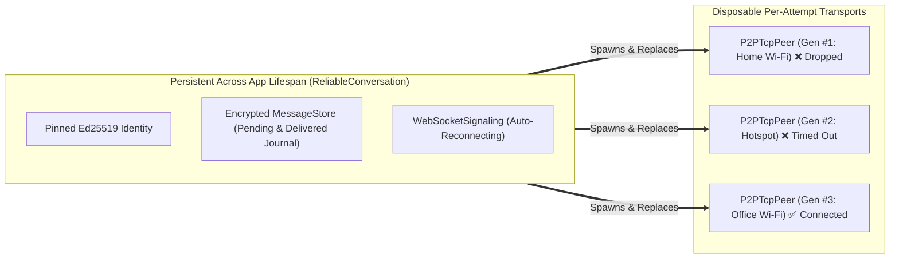
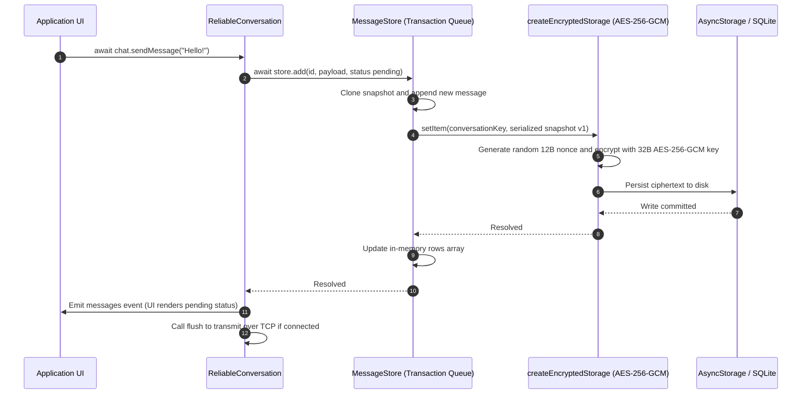

# Reliability, Persistence, and Resilience Deep Dive

> **Documentation Navigation**
> - **[Part 1: Master Architecture & Overview (`HOW_IT_WORKS.md`)](./HOW_IT_WORKS.md)**
> - **[Part 2: Signaling Deep Dive (`SIGNALING_DEEP_DIVE.md`)](./SIGNALING_DEEP_DIVE.md)**
> - **[Part 3: Reliability, Storage & Resilience (`RELIABILITY_AND_RESILIENCE.md`)](./RELIABILITY_AND_RESILIENCE.md)** *(Current Page)*
> - **[Part 4: Cryptography & Wire Protocol Reference (`CRYPTOGRAPHY_AND_WIRE_PROTOCOL.md`)](./CRYPTOGRAPHY_AND_WIRE_PROTOCOL.md)**
> - **[Part 5: Custom Backend Integration (`CUSTOM_BACKEND_INTEGRATION.md`)](./CUSTOM_BACKEND_INTEGRATION.md)**

---

## 1. Why Raw TCP is Not Enough for Mobile P2P Reliability

A common misconception is that because TCP is a "reliable transport protocol," a peer-to-peer chat over TCP is automatically reliable.

In reality, **TCP only guarantees reliability within the lifespan of a single operating system socket descriptor**. On mobile operating systems (iOS and Android), raw TCP sockets are fragile and routinely destroyed by events outside the application's control:

1. **Network Interface Handover**: Walking out of a building switches the phone from Wi-Fi (`192.168.1.x`) to Cellular (`100.64.x.x`). Every open TCP socket bound to the Wi-Fi IP immediately breaks.
2. **OS Backgrounding & App Suspension**: Within seconds of a user locking their screen or switching apps, iOS and Android suspend background socket reads and reclaim listening sockets.
3. **Silent NAT Table Expiration ("Half-Open Sockets")**: If a peer loses power or enters an elevator, no TCP `FIN` or `RST` packet reaches the other device. The surviving device's OS thinks the TCP socket is still open, and `socket.write()` calls silently buffer in the kernel without ever reaching the friend.
4. **In-Flight Crash Loss**: If an app writes a message to a socket and crashes or loses connectivity before the remote application layer processes and persists the message, that message is permanently lost unless backed by a durable write-ahead journal and application-level acknowledgments.

`fprot` solves all of these failure modes in [`ReliableConversation.ts`](../src/reliable/ReliableConversation.ts) and [`MessageStore.ts`](../src/reliable/MessageStore.ts).

---

## 2. Core Design Pattern: Immortal Conversation vs. Disposable Peers

`fprot` strictly separates **Session Transport (`P2PTcpPeer`)** from **Conversation Lifecycle (`ReliableConversation`)**:

- **`P2PTcpPeer` is Strictly Single-Use and Disposable**:
  - A `P2PTcpPeer` instance can transition from `idle` $\rightarrow$ `signaling` $\rightarrow$ `negotiating` $\rightarrow$ `tcp-connecting` $\rightarrow$ `connected` $\rightarrow$ `closed`/`failed` **exactly once**.
  - Calling `createOffer()` or `acceptOffer()` a second time throws `Error('A P2PTcpPeer instance can establish only one session')`.
  - When a socket error, decryption error, or close occurs, `P2PTcpPeer.dispose()` destroys the TCP socket, closes the TCP server, closes WebRTC, and zeroes out the ephemeral X25519 private key in memory (`this.keys?.privateKey.fill(0)`).
- **`ReliableConversation` is Persistent and Self-Healing**:
  - Whenever `ReliableConversation` needs to connect or reconnect, `newPeer()` instantiates a **brand-new `P2PTcpPeer`**, increments `this.generation`, generates fresh ephemeral X25519 keys, invokes `getHostOptions()` to fetch the device's *current* IP address, and negotiates a fresh TCP connection.



---

## 3. Generation Fencing & Race Condition Elimination

In asynchronous mobile networking, multiple events can overlap dangerously. For example:
- Peer #1 (Generation 1) is halfway through async `getHostOptions()` or `createOffer()` when the user switches Wi-Fi networks and calls `reconnect()`, spawning Peer #2 (Generation 2).
- Milliseconds later, Peer #1's `createOffer()` resolves or Peer #1 emits an `error` or `close` event.

Without protection, Peer #1's late callbacks would corrupt Peer #2's active handshake!

### How `this.generation` and `this.current(peer, generation)` Work

In [`ReliableConversation.ts`](../src/reliable/ReliableConversation.ts):
1. Every time `newPeer()` or `dropPeer()` is called, `++this.generation` increments an integer counter.
2. Every event listener (`state`, `error`, `close`, `message`), timer (`deadline`, `ackTimer`), and async `await` continuation captures both `(peer, generation)` in its closure and checks:
   ```ts
   private current(peer: SessionTransport, generation: number): boolean {
     return (
       this.active &&
       this.online &&
       this.peer === peer &&
       generation === this.generation
     );
   }
   ```
3. If `this.current(peer, generation)` returns `false`, the callback immediately returns as a no-op. Stale peers are mathematically incapable of mutating conversation state or sending obsolete signals.

### Serialized Inbound Promise Queue (`this.inbound`)

When TCP chunks arrive rapidly, `LineDecoder` may emit multiple decrypted packets in the same tick. Because handling a packet requires asynchronous disk I/O (`await this.store.add(...)` or `await this.store.acknowledge(...)`), processing packets concurrently could cause out-of-order storage writes or race conditions on `this.inFlight`.

`ReliableConversation` serializes all incoming packets through a single promise chain (`this.inbound`):
```ts
peer.on('message', (message) => {
  this.inbound = this.inbound
    .then(async () => {
      if (this.current(peer, generation))
        await this.receivePacket(message.payload, peer, generation);
    })
    .catch((error) => {
      if (this.current(peer, generation)) this.retry(error);
    });
});
```
Every packet is guaranteed to finish its `MessageStore` transaction before the next packet starts executing.

---

## 4. Durable Write-Ahead Message Journal (`MessageStore.ts`)

### 4.1 Write-Before-Memory Commit Pattern

`MessageStore` implements a strict **single-writer write-ahead journal** (`this.queue`). When `sendMessage(payload)` or `receivePacket()` adds or acknowledges a message:



Notice the ordering:
1. **`storage.setItem()` resolves on disk BEFORE `this.rows` is mutated in memory** (`MessageStore.ts` lines 81-85).
2. **`sendMessage()` awaits `this.store.add()` BEFORE calling `this.publishMessages()` or `this.flush()`**.
3. Even if the device battery dies 1 millisecond after `sendMessage()` resolves, the message is safely encrypted on disk with `status: 'pending'` and will automatically be transmitted the next time the app launches and connects.

### 4.2 Strict Payload & Storage Validation

To prevent subtle JSON serialization bugs and storage exhaustion, `MessageStore` enforces:
- **Max Serialized Payload Length**: `MAX_MESSAGE_BYTES / 6` = **2,730 characters** when JSON-serialized (`MAX_MESSAGE_BYTES = 16,384`).
- **Strict JSON Value Purity (`validatePayload`)**:
  - Standard `JSON.stringify` silently drops `undefined` object properties, drops `function` and `symbol` values, and silently turns `NaN` and `Infinity` into `null`.
  - `validatePayload` walks every key/value via a custom replacer and **explicitly throws `Error('Message contains a non-JSON value')`** if `undefined`, `function`, `symbol`, `NaN`, or `Infinity` is present anywhere in the payload tree.
- **Bounded History (`MAX_MESSAGES = 2000`)**:
  - Caps a single conversation store at `2,000` messages (`Error('Conversation storage full (2000 messages). Export/archive before continuing.')`) so `AsyncStorage` snapshots never grow unbounded.
- **Integrity Verification on `load()`**:
  - Validates schema version (`data.v === 1`), message count (`<= 2000`), 16-char ID regex (`/^[A-Za-z0-9_-]{16}$/`), finite `sentAt` timestamp, valid `direction` (`incoming | outgoing`), valid `status` (`pending | delivered`), payload validity, and uniqueness of `${row.direction}:${row.id}`.

### 4.3 Encrypted At-Rest Storage & Record Binding (`createEncryptedStorage`)

In [`src/reliable/identity.ts`](../src/reliable/identity.ts), `createEncryptedStorage(storage, secureStorage)` wraps an untrusted persistence backend (like React Native `AsyncStorage`) with authenticated encryption:
- Generates a 32-byte symmetric key via `secretboxKeygen()` and stores it inside hardware-backed `secureStorage` (`Keychain` / `Keystore`) under `'fprot.storage-key.v1'`.
- Computes a deterministic, privacy-preserving storage key for each conversation using 32-byte `SHA-256` (`sha256`):
  ```ts
  conversationStorageKey(id, local, remote) =
    `fprot.chat.${base64url(SHA256(JSON.stringify([id, local, remote])))}`
  ```
- **Anti-Swapping Record Binding**: When encrypting a value for `name`, `createEncryptedStorage` encrypts `JSON.stringify({ name, value })` inside the `secretboxSeal` (`AES-256-GCM`) ciphertext. Upon decryption, it checks `plain.name !== name`. This prevents an attacker with filesystem access from swapping encrypted blobs between different storage keys!

---

## 5. Stop-and-Wait ARQ, Ordering, and Idempotent Deduplication

How does `ReliableConversation` guarantee that messages arrive in the exact order they were sent, without duplicates and without losing messages when connections drop mid-transmission?

### 5.1 Single In-Flight Stop-and-Wait Protocol (`this.inFlight`)

In `ReliableConversation.flush()`:
```ts
private flush(): void {
  if (this.state !== 'connected' || this.inFlight) return;
  const message = this.store?.pending();
  if (!message) return;
  this.inFlight = message.id;
  // One outstanding message bounds buffering and preserves send order.
  this.ackTimer = setTimeout(
    () => this.retry(new Error('Message acknowledgement timed out')),
    this.timing.ack
  );
  this.sendPacket({
    kind: 'message',
    id: message.id,
    payload: message.payload,
    sentAt: message.sentAt,
  });
}
```
1. `this.store.pending()` returns the **oldest** outgoing message whose `status === 'pending'`.
2. `this.inFlight = message.id` acts as a mutex lock: **at most one unacknowledged message is on the wire at any time**.
3. `this.ackTimer` starts a countdown (`ackTimeoutMs`, default `10,000 ms`).
4. Only when the remote peer replies with `{ kind: 'ack', id: this.inFlight }` does the sender:
   - Mark the message as `'delivered'` on disk (`await this.store.acknowledge(value.id)`).
   - Clear `this.ackTimer` and `this.inFlight = undefined`.
   - Call `this.flush()` to transmit the next queued `'pending'` message!

### 5.2 What Happens When an ACK is Lost? (Idempotent Deduplication)

Suppose Device A sends Message `m1` (`id: "AbCdEfGhIjKlMnOp"`).
1. Device B receives `m1`, saves it to `MessageStore` (`direction: 'incoming', status: 'delivered'`), emits it to Device B's UI, and sends `{ kind: 'ack', id: "AbCdEfGhIjKlMnOp" }`.
2. **Failure**: Right as Device B sends the `ack`, the Wi-Fi drops! Device A never receives the `ack`.
3. Device A's `ackTimer` expires (or the socket closes), resetting `this.inFlight = undefined` and leaving `m1` as `status: 'pending'` in Device A's store.
4. Both devices automatically reconnect over a new `P2PTcpPeer` (Generation 2).
5. Device A's `connected()` handler calls `this.flush()`, which **re-transmits `m1` (`id: "AbCdEfGhIjKlMnOp"`)**.
6. Device B receives `m1` a second time and calls `await this.store.add(...)`.
7. Inside `MessageStore.add()`:
   ```ts
   const previous = rows.find(
     (row) => row.id === safe.id && row.direction === safe.direction
   );
   if (previous) {
     if (
       previous.sentAt !== safe.sentAt ||
       JSON.stringify(previous.payload) !== JSON.stringify(safe.payload)
     )
       throw new Error('Message ID reused with different contents');
     return false;
   }
   ```
   - `MessageStore` detects that `incoming:AbCdEfGhIjKlMnOp` is already stored with identical `sentAt` and `payload`!
   - It safely returns `false` without adding a duplicate entry.
   - Device B then **re-sends `{ kind: 'ack', id: "AbCdEfGhIjKlMnOp" }`** (`ReliableConversation.ts` line 423).
8. Device A receives the `ack`, transitions `m1` to `'delivered'`, and moves on to `m2`.

**Result**: **Exactly-once delivery in the UI**, **at-least-once delivery on the wire**, and **strict FIFO ordering**.

---

## 6. Heartbeats, Dead-Peer Detection, and Signaling Glare Immunity

### 6.1 Encrypted Application-Layer Heartbeats (`ping` / `pong`)

When a session enters `connected`, `ReliableConversation` starts a periodic heartbeat timer (`this.heartbeat`):
- Every `heartbeatMs` (default `10,000 ms`), it checks how much time has elapsed since the last valid packet of *any* kind (`message`, `ack`, `ping`, or `pong`) was received from the partner (`Date.now() - this.lastReceived`).
- If `Date.now() - this.lastReceived > this.timing.idle` (default `35,000 ms`), it immediately declares the TCP connection dead (`this.retry(new Error('Peer heartbeat timed out'))`), tears down the peer, and enters `reconnecting`.
- Otherwise, it sends an encrypted `{ kind: 'ping', protocol: 'fprot.chat.v1', conversationId }`, to which the remote peer immediately responds with `{ kind: 'pong', protocol: 'fprot.chat.v1', conversationId }`.

### 6.2 Why `connected` Peers Ignore Incoming Signals

Look closely at line 235 of [`ReliableConversation.ts`](../src/reliable/ReliableConversation.ts):
```ts
// Connected peers detect a restarted partner through the encrypted heartbeat timeout.
if (this.state === 'connected') return;
```
**Why is this line critical for security and stability?**
- Suppose Device A and Device B have a healthy, connected TCP chat session.
- If a transient network hiccup causes `WebSocketSignaling` to reconnect and emit a stale `wake` or `request`, or if an attacker replays a recorded `wake` packet on the signaling channel, tearing down an active `connected` TCP socket in response to a signaling message would allow trivial Denial-of-Service disruption.
- Instead, an active `connected` peer trusts **only its encrypted TCP stream**. If the remote partner genuinely restarted its app (losing its TCP socket), the surviving peer will detect the silent partner via the encrypted heartbeat (`idleTimeoutMs`) or TCP `close`/`end` event, transition to `reconnecting`, and *then* process new signaling handshakes.

---

## 7. Exponential Backoff, Jitter, and Timing Reference

### 7.1 Configurable Timing Parameters (`ReliableConversationOptions`)

Constructor validation enforces that all timing values are positive finite numbers, `retryMaxMs >= retryMinMs`, and **`idleTimeoutMs > heartbeatMs`**.

| Option | Default | Role & Behavior |
| :--- | :--- | :--- |
| `retryMinMs` | `1,000 ms` (1s) | Base delay for exponential backoff between discovery retries (`wake` / `request`). |
| `retryMaxMs` | `30,000 ms` (30s) | Maximum cap (before jitter) on discovery backoff delay. |
| `handshakeTimeoutMs` | `45,000 ms` (45s) | Maximum time (`this.deadline`) allowed from `newPeer()` creation until TCP reaches `connected`. |
| `heartbeatMs` | `10,000 ms` (10s) | Interval at which encrypted `ping` packets are sent over TCP. |
| `idleTimeoutMs` | `35,000 ms` (35s) | Maximum silence duration before the peer is declared dead (`Peer heartbeat timed out`). Must be `> heartbeatMs`. |
| `ackTimeoutMs` | `10,000 ms` (10s) | Maximum time to wait for a `{ kind: 'ack' }` for `this.inFlight` before tearing down and retrying. |

### 7.2 Exponential Backoff with Jitter Formula

Both `ReliableConversation.scheduleRetry()` and `WebSocketSignaling` apply **exponential backoff with multiplicative uniform jitter** (`0.75x` to `1.25x`):

$$\text{delay}(n) = \min\left(\text{max}, \text{min} \times 2^{\min(n, 10)}\right) \times (0.75 + 0.5 \times U(0, 1))$$

Where $n$ is `this.retries` (reset to `0` whenever `connected()` succeeds or `setAvailable(true)` is called) and $U(0, 1)$ is `Math.random()`.

| Retry Attempt ($n$) | Base Delay (`min=1000`, `max=30000`) | Actual Delay Range with Jitter (`0.75x` – `1.25x`) |
| :---: | :---: | :---: |
| `0` | `1,000 ms` | `750 ms` – `1,250 ms` |
| `1` | `2,000 ms` | `1,500 ms` – `2,500 ms` |
| `2` | `4,000 ms` | `3,000 ms` – `5,000 ms` |
| `3` | `8,000 ms` | `6,000 ms` – `10,000 ms` |
| `4` | `16,000 ms` | `12,000 ms` – `20,000 ms` |
| `5+` | `30,000 ms` (capped) | `22,500 ms` – `37,500 ms` |

### 7.3 Integrating OS Lifecycle & Network Changes (`setAvailable` & `reconnect`)

To achieve instant recovery on mobile devices without waiting for `idleTimeoutMs` (`35s`), host applications wire React Native's `AppState` and `NetInfo` into two methods on `ReliableConversation`:

1. **`conversation.setAvailable(boolean)`**:
   - Pass `false` when the device loses internet connectivity (`!netInfo.isConnected`) or when the app enters the background for an extended period. This immediately drops the peer, clears retry timers, and transitions state to `'offline'` while preserving all `'pending'` messages on disk.
   - Pass `true` when the app returns to the foreground or regains connectivity. This resets `this.retries = 0`, transitions state to `'reconnecting'`, and immediately calls `this.discover()` with zero backoff delay.
2. **`conversation.reconnect()`**:
   - Call this when `NetInfo` reports that the active network interface or local IP address changed (e.g., switching from one Wi-Fi router to another, or toggling VPN) even though `isConnected` remained `true`.
   - It immediately drops the stale TCP socket, invokes `getHostOptions()` with the new IP address, and re-handshakes.
