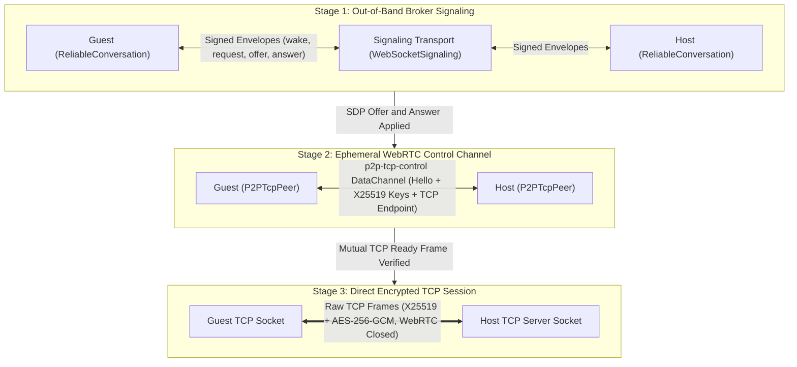
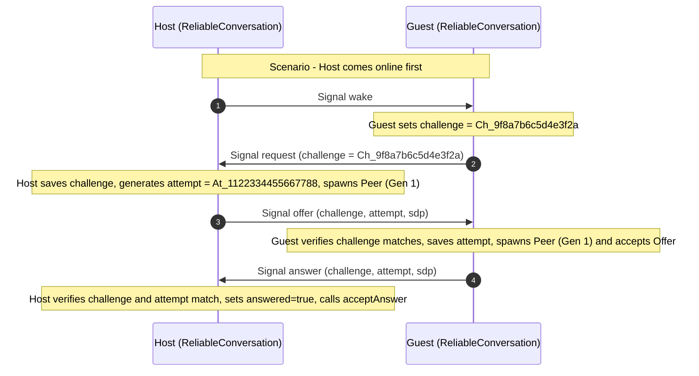

# Signaling Deep Dive: Architecture, Protocol, and Internals

> **Documentation Navigation**
> - **[Part 1: Master Architecture & Overview (`HOW_IT_WORKS.md`)](./HOW_IT_WORKS.md)**
> - **[Part 2: Signaling Deep Dive (`SIGNALING_DEEP_DIVE.md`)](./SIGNALING_DEEP_DIVE.md)** *(Current Page)*
> - **[Part 3: Reliability, Storage & Resilience (`RELIABILITY_AND_RESILIENCE.md`)](./RELIABILITY_AND_RESILIENCE.md)**
> - **[Part 4: Cryptography & Wire Protocol Reference (`CRYPTOGRAPHY_AND_WIRE_PROTOCOL.md`)](./CRYPTOGRAPHY_AND_WIRE_PROTOCOL.md)**
> - **[Part 5: Custom Backend Integration (`CUSTOM_BACKEND_INTEGRATION.md`)](./CUSTOM_BACKEND_INTEGRATION.md)**

---

## 1. What is Signaling? (Fundamental Concepts)

In peer-to-peer (P2P) networking, two devices (such as two smartphones running a React Native app) want to open a direct, encrypted TCP socket between each other without routing their conversation through a central database or chat server.

However, they face the **Peer-to-Peer Bootstrap Paradox**:
1. **No Static Address**: Mobile devices constantly change IP addresses as users move between Wi-Fi networks, VPNs, and cellular towers.
2. **Ephemeral Listening Ports**: For security and OS resource management, the Host device opens a temporary TCP server on a dynamically assigned port (e.g., `54321`) only when a session is being negotiated.
3. **Asynchronous Availability**: Device A might open the app at 14:00 while Device B is asleep in a pocket and opens the app at 14:02. Neither knows *when* the other is ready to connect.
4. **Session Key Negotiation**: Before the Guest connects to the Host's TCP port, both devices must exchange ephemeral X25519 public keys so the very first byte sent over TCP is already end-to-end encrypted.

**Signaling** is the lightweight, out-of-band coordination mechanism used to solve this paradox. It allows two peers to:
- Discover when the other peer is online (`wake` and `request`).
- Exchange network reachability metadata (WebRTC Session Description Protocol / SDP and ICE candidates).
- Verify each other's long-term cryptographic identity (`Ed25519` digital signatures) before opening any direct socket.

### What Signaling Is vs. What Signaling Is NOT

| Aspect | What Signaling IS in `fprot` | What Signaling is NOT in `fprot` |
| :--- | :--- | :--- |
| **Role** | A matchmaking / rendezvous courier for connection setup. | A chat server, message relay, or media proxy. |
| **Traffic Carried** | Small control envelopes (`wake`, `request`, `offer`, `answer`). | Application chat messages, files, or heartbeats (`ping`/`pong`/`ack`). |
| **Lifespan** | Active only while discovering a peer or reconnecting after a drop. | Involved during active TCP messaging. |
| **Trust Level** | **Untrusted**. Even a malicious signaling server cannot read chats or impersonate a peer. | A trusted authority that manages encryption keys or user identities. |
| **Persistence** | Stateless and ephemeral (signals expire in seconds). | A database or message mailbox that stores offline messages. |

---

## 2. The Two-Stage Bootstrap Architecture in `fprot`

A unique architectural feature of `fprot` is that connection establishment happens in **two distinct stages** before settling into a pure raw TCP stream:



### Why Use Both a Signaling Broker AND a WebRTC Data Channel?

1. **Stage 1: Out-of-Band Signaling (`SignalProtocol.ts` + `WebSocketSignaling.ts`)**
   - Handles **asynchronous discovery** (when one device is offline or reconnecting), **Ed25519 identity verification**, **replay defense** (`challenge` and `attempt` nonces), and **SDP delivery**.
2. **Stage 2: In-Band WebRTC Control Channel (`p2p-tcp-control` inside `P2PTcpPeer.ts`)**
   - Once the SDP `offer` and `answer` are exchanged, WebRTC establishes a peer-to-peer SCTP data channel (`p2p-tcp-control`, configured with `{ ordered: true }`).
   - Over this channel, the peers exchange a `ControlHello` containing their fresh **ephemeral X25519 session public keys** and the Host's bound **TCP IP address and listening port**, followed by a `ControlConnect` trigger.
   - This decoupling means `P2PTcpPeer` can also be used **standalone without a signaling server** (for example, by exchanging the offer/answer strings via QR codes, AirDrop, NFC, or a REST API).
3. **Stage 3: WebRTC Shutdown & Pure TCP Cutover (`markConnected()`)**
   - As soon as the Guest connects to the Host's TCP port and both peers verify a mutually encrypted `ready` frame (`seq: 1`), `P2PTcpPeer.markConnected()` immediately **closes the WebRTC DataChannel, closes the `RTCPeerConnection`, and closes the Host's listening TCP server socket** so no other connections can be accepted.
   - From that point forward, zero WebRTC threads or signaling resources are used for the conversation.

---

## 3. Complete Signaling Protocol Specification (`SignalProtocol.ts`)

In `ReliableConversation`, every signal exchanged over `SignalTransport` is governed by `src/reliable/SignalProtocol.ts`.

### 3.1 The Four Signal Types

| Signal Type | Sender Role | Receiver Role | Purpose & Trigger Condition |
| :--- | :--- | :--- | :--- |
| **`wake`** | `host` | `guest` | Sent by the Host when it starts up or reconnects (`discover()`). Tells any listening Guest: *"I am online and ready; send me a `request` if you want an offer."* |
| **`request`** | `guest` | `host` | Sent by the Guest when it starts up (`discover()`) or in response to a `wake` from the Host. Carries a freshly generated 16-character `challenge` nonce. |
| **`offer`** | `host` | `guest` | Sent by the Host upon receiving a valid `request`. Starts a TCP listener, generates a WebRTC SDP offer, echoes the Guest's `challenge`, and attaches a new 16-character `attempt` ID. |
| **`answer`** | `guest` | `host` | Sent by the Guest upon receiving an `offer` whose `challenge` matches its active challenge. Applies the remote offer, generates a WebRTC SDP answer, and echoes both `challenge` and `attempt`. |

### 3.2 The `challenge` and `attempt` Anti-Replay Mechanism

Network conditions on mobile devices frequently cause duplicate packets, delayed WebSocket frames, or simultaneous reconnection retries. Without strict session correlation, an old delayed `offer` could overwrite a newer `offer`, causing a half-open deadlock (known as *glare*).

`fprot` prevents this using a two-part cryptographic nonce binding:

1. **`challenge` (Generated by Guest, 16-char base64url / 96 bits of entropy)**:
   - When the Guest calls `discover()`, if `this.challenge` is empty, it generates `this.challenge = randomId()`.
   - **Crucial Design Rule (`ReliableConversation.ts` line 237)**: If the Guest receives multiple `wake` signals from the Host while waiting for an `offer`, the Guest **reuses its existing `this.challenge`** (`if (!this.challenge) this.challenge = randomId()`). This ensures that a repeated `wake` signal does not invalidate an `offer` that the Host is currently busy generating!
   - When the Guest receives an `offer`, it strictly checks `signal.challenge === this.challenge`. Stale or replayed offers from previous sessions are silently ignored.
2. **`attempt` (Generated by Host, 16-char base64url / 96 bits of entropy)**:
   - When the Host receives a `request`, it stores `this.challenge = signal.challenge`, generates a brand-new `this.attempt = randomId()`, creates a new `P2PTcpPeer`, and sends `offer` with both `(challenge, attempt)`.
   - When the Guest replies with `answer`, it echoes both `challenge` and `attempt`.
   - The Host only accepts an `answer` if:
     - `this.role === 'host'`
     - `this.peer` exists and `!this.answered`
     - `signal.challenge === this.challenge`
     - `signal.attempt === this.attempt`
   - Once accepted, `this.answered = true` prevents duplicate `answer` signals from calling `acceptAnswer()` twice.



---

## 4. Three-Layer Wire Format of a Signal

When a signal is transmitted over `WebSocketSignaling` and `server/signaling.mjs`, it is encapsulated in **three nested JSON layers**. Understanding all three layers is essential when debugging or building custom signaling backends.

### Layer 1: The Inner `Signal` Object (`SignalProtocol.ts`)
This is the canonical payload serialized to a JSON string (`body`):
```json
{
  "v": 1,
  "from": "7bQ9_3xLp2mN8vR4kW1yZ6cT0hJ5gF3dS9aE2uI8oP0",
  "to": "4mK8_1pQr9vX3zN7bL2wY5cT8hJ0gF6dS4aE1uI7oP9",
  "conversationId": "main-chat-room",
  "type": "offer",
  "challenge": "aB3dE6fG9hJ2kL5m",
  "attempt": "pQ8rS1tU4vW7xY0z",
  "sdp": "{\"v\":1,\"type\":\"offer\",\"sdp\":\"v=0\\r\\no=- ...\"}"
}
```
> [!NOTE]
> Notice that `signal.sdp` for `offer` and `answer` is itself the JSON string returned by `P2PTcpPeer.createOffer()` / `acceptOffer()` from `src/internal/signaling.ts` (`{"v":1,"type":"offer","sdp":"v=0..."}`). For `wake` and `request` signals, `sdp` is `""`.

### Layer 2: The Cryptographically Signed Envelope (`encodeSignal`)
`encodeSignal(signal, identity)` stringifies Layer 1 into `body`, prefixes it with the domain separation tag `fprot.signaling.v1:`, signs that string with the sender's 64-byte Ed25519 private key, and returns:
```json
{
  "body": "{\"v\":1,\"from\":\"7bQ9...\",\"to\":\"4mK8...\",\"conversationId\":\"main-chat-room\",\"type\":\"offer\",\"challenge\":\"aB3dE6fG9hJ2kL5m\",\"attempt\":\"pQ8rS1tU4vW7xY0z\",\"sdp\":\"...\"}",
  "signature": "9xK2mP8vL4nQ7rT1wY5zC3bF6hJ0gD9sA2eU4iO8pM1kN3vB7xZ0cR5tY8uI2oP6aS9dF1gH4jK7lL0mN3bV6c"
}
```

### Layer 3: The WebSocket Broker Frame (`WebSocketSignaling.ts`)
When `WebSocketSignaling.send(envelopeString)` transmits Layer 2 to `server/signaling.mjs`, it wraps the signed envelope string inside a broker transport message:
```json
{
  "type": "signal",
  "data": "{\"body\":\"{\\\"v\\\":1,...}\",\"signature\":\"9xK2mP8...\"}"
}
```

### Validation Rules in `decodeSignal()` (`SignalProtocol.ts`)
When the recipient receives `raw` (Layer 2 string), `decodeSignal` enforces **8 strict checks**:
1. **Max Size Guard**: `raw.length <= 131,072` (128 KB). Prevents memory exhaustion / JSON parsing DoS.
2. **Envelope Structure & Signature Verification**: Parses `envelope`, checks `typeof envelope.body === 'string'` and `typeof envelope.signature === 'string'`, and verifies `verifyDetached("fprot.signaling.v1:" + envelope.body, signature, remotePublicKey)`.
3. **Version Check**: `signal.v === 1`.
4. **Sender Pinning**: `signal.from === remoteKey` (must match the pinned friend public key).
5. **Recipient Binding**: `signal.to === localKey` (must be addressed to our own public key, preventing reflection or misrouted broadcast acceptance).
6. **Conversation Scope Binding**: `signal.conversationId === conversationId` (prevents cross-conversation replay between the same two peers).
7. **Type Whitelist**: `['wake', 'request', 'offer', 'answer'].includes(signal.type)`.
8. **Nonce Format Validation**:
   - If `signal.type !== 'wake'`, `signal.challenge` MUST match `/^[A-Za-z0-9_-]{16}$/`.
   - If `signal.type === 'offer' || signal.type === 'answer'`, `signal.attempt` MUST match `/^[A-Za-z0-9_-]{16}$/`.

---

## 5. Broker Authentication & `server/signaling.mjs` Internals

While `fprot` supports any custom signaling transport (`SignalTransport`), it ships with a hardened, zero-persistence WebSocket broker in [`server/signaling.mjs`](../server/signaling.mjs) and a matching client in [`src/reliable/WebSocketSignaling.ts`](../src/reliable/WebSocketSignaling.ts).

### 5.1 Challenge-Response Authentication Flow

To prevent unauthorized internet scanners from connecting to the broker or spoofing another peer's public key on the routing table, the broker performs a **two-factor cryptographic handshake** on every WebSocket connection:

1. **Factor 1 (Shared Deployment Secret)**: A pre-shared token (`FPROT_SIGNAL_TOKEN`) of at least 32 characters, verified on the server using constant-time comparison (`crypto.timingSafeEqual`) to prevent timing side-channel attacks.
2. **Factor 2 (Ed25519 Proof of Possession)**:
   - Upon connection, the server generates a 32-byte random challenge (`randomBytes(32).toString('hex')` — 64 hex chars) and sends:
     ```json
     { "type": "challenge", "nonce": "4f8a9c0e1b2d3f4a5c6e7b8d9f0a1c2e3b4d5f6a7c8e9b0d1f2a3c4e5b6d7f8a" }
     ```
   - `WebSocketSignaling` validates `/^[a-f0-9]{64}$/.test(value.nonce)` and signs the domain-separated string `fprot.broker.v1:${value.nonce}` with the device's Ed25519 private key:
     ```json
     {
       "type": "auth",
       "token": "your-32-char-minimum-shared-secret-token",
       "publicKey": "7bQ9_3xLp2mN8vR4kW1yZ6cT0hJ5gF3dS9aE2uI8oP0",
       "signature": "base64url_ed25519_signature_over_fprot_broker_v1_nonce"
     }
     ```
   - The server converts the 32-byte raw Ed25519 public key into an ASN.1 DER SPKI structure by prepending the standard 12-byte Ed25519 OID header (`302a300506032b6570032100` in hex) and calls Node's native `crypto.verify()`.
   - If valid, the server binds `peers.set(publicKey, socket)` (closing any stale socket previously registered to that `publicKey` with code `1000 "Identity reconnected"`) and sends:
     ```json
     { "type": "ready" }
     ```

### 5.2 Built-in Hardening & DoS Protections in `server/signaling.mjs`

| Protection Mechanism | Implementation in `server/signaling.mjs` | Value / Threshold |
| :--- | :--- | :--- |
| **Max Concurrent Connections** | Checks `server.clients.size > 100` on connect; closes with WebSocket status `1013` (`Server full`). | `100` clients |
| **Compression Bomb Defense** | `perMessageDeflate: false` disables zlib decompression bombs. | Disabled |
| **Max WebSocket Frame Size** | `maxPayload: 132 * 1024` (client also enforces `event.data.length <= 132 * 1024`). | `132 KB` |
| **Authentication Deadline** | `authTimeout` closes unauthenticated sockets with status `1008` (`Authentication timeout`). | `10,000 ms` (10s) |
| **Per-Socket Rate Limiter** | Fixed-window counter (`count > 120` per `60,000 ms`) disconnects flooding clients with status `1008`. | `120 msgs / min` |
| **Binary Frame Rejection** | Rejects binary WebSocket frames (`if (binary) throw new Error('Text only')`). | UTF-8 JSON only |
| **Sender Spoofing Prevention** | Parses `envelope.body` and enforces `body.from === publicKey` (the socket's authenticated Ed25519 key). | Strict match |
| **Dead Socket Cleanup** | Server pings every `30,000 ms` (`socket.ping()`); terminates sockets that fail to respond with a `pong`. | `30s` interval |

---

## 6. In-Band WebRTC Control Channel (`p2p-tcp-control`)

Once `ReliableConversation` finishes exchanging the `offer` and `answer` via the signaling broker, control passes inside `P2PTcpPeer.ts` to the temporary WebRTC data channel named `p2p-tcp-control`.

Here is the exact sequence that occurs inside `P2PTcpPeer`:

1. **Host Prepares Listener (`createOffer`)**:
   - Generates an ephemeral X25519 session keypair (`createSessionKeys()`).
   - Binds a local TCP server (`TcpSocket.createServer`) on `host.listenHost ?? '0.0.0.0'` and `host.port ?? 0` (OS selects a free ephemeral port).
   - Records `this.endpoint = { host: host.advertiseHost, port: boundPort }`.
   - Creates an ordered WebRTC DataChannel `p2p-tcp-control`.
2. **Channel Opens (`setupControlChannel`)**:
   - **Host sends `ControlHello`**:
     ```json
     {
       "type": "hello",
       "v": 1,
       "publicKey": "EPHEMERAL_X25519_PUBLIC_KEY_HOST",
       "endpoint": { "host": "192.128.0.0", "port": 54321 }
     }
     ```
   - **Guest sends `ControlHello`**:
     ```json
     {
       "type": "hello",
       "v": 1,
       "publicKey": "EPHEMERAL_X25519_PUBLIC_KEY_GUEST"
     }
     ```
3. **Host Triggers TCP Connection (`handleControlMessage`)**:
   - When the Host receives the Guest's `ControlHello`, it stores the Guest's 32-byte X25519 `remotePublicKey` ( enabling the Host's TCP server to accept the upcoming connection; any TCP connection arriving *before* `this.remotePublicKey` is known is immediately destroyed via `socket.destroy()`!).
   - The Host then sends:
     ```json
     { "type": "connect" }
     ```
4. **Guest Opens Direct TCP Socket (`connectTcp`)**:
   - Upon receiving `{ "type": "connect" }`, the Guest verifies it has received both `remotePublicKey` and `endpoint`, transitions to `tcp-connecting`, and opens a raw TCP connection (`TcpSocket.createConnection`) to `endpoint.host:endpoint.port`.
   - Once TCP connects, the Guest sends an encrypted `ready` frame (`seq: 1`), the Host verifies it and replies with its own encrypted `ready` frame (`seq: 1`), and both sides call `markConnected()`, destroying the WebRTC session.
